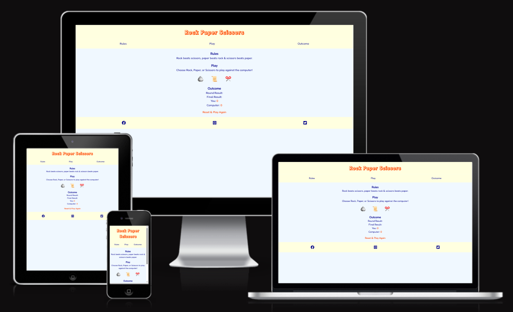
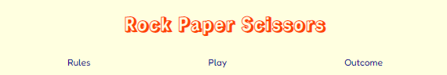
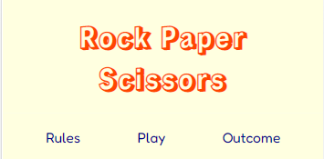
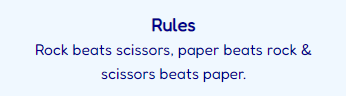
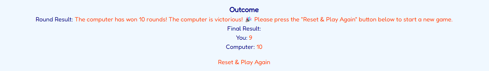
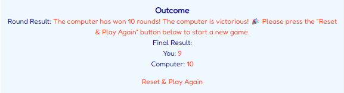
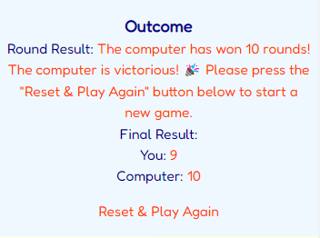

# Rock Paper Scissors

- Rock Paper Scissors is an implementation of the popular, time-honored game, "Rock Paper Scissors". People who like this kind of games that depends on pure luck will seek it as this game will entertain them.
- I developed Rock Paper Scissors as my portfolio project 2 of my full stack software development diploma with the Code Institute in Dublin, Ireland.

# 1. User Stories

- As a visiting user, I would like to know the rules of the Rock Paper Scissors game and to play it.

# 2. Existing Features

- ## 2. 1. Navigation bars

  - There are two fully responsive navigation bars that are directly above each other.
  - The first navigation bar is for the logo and contains a link that when clicked takes a user back the top of the game page.
  - The other navigtion bar is for the rules section, the play section, and the outcome section and contains a link for each of those three sections; by clicking on a link of those, a user will be taken back to the relevant section, which will allow them to easily navigate from section to section across all devices without having to revert to the previous section via the "back" button.
  - Please consider that this game is one-page website; as such, the user would rarely need to use navigation bars, except when they are playing this game on a smartphone that has a very small screen.
  - Please find below images of the navigation bars on differenct screen sizes.

- ## 2. 2. Rules section

  - Here are the rules of the game simply stated: Rock beats scissors, scissors beats paper, and paper beats rock.
  - Beneath are images of the rules section.

- ## 2. 3. Play section

  - At the beginning of the play section, a user is instructed to choose one of three options: Either "Rock", "Paper", or "Scissors" to play against the computer.
  - A user finds those options underneath those instructions in the form of three emojis, which are put inside three buttons, one for each of the three options.
  - As a user chooses an emoji, the computer spontaneously chooses an emoji.
  - The game rules dictate who wins a round of the game.
  - Further down are images of the play section.

- ## 2. 4. Outcome section

  - The result of each round will be demonstrated at the top of this section.
  - Below a round's result is the final result of a game that determines who won a whole game. A user's score and the computer's score specify the final result of a game.
  - If a user wins a round, their score will be incremented by 1; similarly, if the computer wins a round, its score will be incremented by 1. If, however, neither a user nor the computer wins, the scores will remain the same.
  - As soon as a user or the computer has won 10 rounds, a round result' paragraph will pop, enlighten a user that they have won 10 rounds, thus winning the whole game, and encourage a user to click on the "Reset & Play Again" button, which is both found and accetuated at the bottom of the outcome section, to have a go at a new game.
  - please view the images of the outcome section below.

- ## 2. 5. Footer

  - The footer section contains links to the relevant social media sites of the game.
  - The links will open a new tab to allow easy navigation for the user.
  - Clicking on the Instagram link opens the game's page on Instagram in a new tab.
  - Clicking on the Facebook link opens the game's page on Facebook in a new tab.
  - Clicking on the Twitter link opens the game's page on Twitter in a new tab.
  - A user will treasure the footer, because it fascilitates getting connected by way of the social media links of the game.
  - Please take a look at some of the relevant images further down.

# 3. Future features

- Incorportating several difficulty levels into the game.
- Developing the option of multiplayer; for example, between two users.

# 4. Typography and color scheme

- Three fonts from Google Fonts have been inserted into the style.css file: "Rampart One", "Fredoka", and "sans-serif".
- Two colors have been applied as font colors: #00008B and #ff4500.
- Two colors have been applied as background colors: #f0f8ff and #ffffe0.
- Three emojis from www.emojipedia.org have been utilized as the game buttons: "rock", "paper", and "scissors".
- Three icons from Font Awesome have been implemented as the social media icons: Facebook, Twitter, and Instagram.

# 5. Wireframes

- Only one wireframe has been created.
- Down is an image of that wireframe thanks to Balsamiq.

# 6. Technology

- ## 6. 1. HTML

  - Using HTML, I created the content of the Rock Paper Scissor's website, made it accessible, and provided the relevant structure for search engine optimization.

- ## 6. 2. CSS

  - I utilized CSS to make the content of this game's website both visually appealing and responsive on different screen sizes of laptops, tabs, and smartphones.

- ## 6. 3. Codeanywhere

  - Codeanywhere is an efficient cloud-based integrated development environment that I employed to write, review, integrate, and deploy the HTML and CSS code of the Rock Paper Scissors website without any need for any installations or configurations.

- ## 6. 4. GitHub

  - A platform for version control and collaborative software development, which I exploited to create a central code repository for and deploy the website of Rock Paper Scissors game project; this, in turn, allows me to keep track of changes made to code and revert to previous versions if needed.

- ## 6. 5. Balsamiq

  - This is the program I applied to generate the framework of the website of the game project.

- ## 6. 6. Google Fonts

  - I resorted to Google Fonts to amplify the look of the Rock Paper Scissors' website, so I integrated two of its fonts into the website by inserting their links in their respective CSS file.
  - The "sans-serif" font has been integrated into the style.css file as a backup font.

- ## 6. 7. Font Awesome

  - To enhance the visual design of the game's website, I have turned to Font Awesome and incorporated 3 icons into it as the icons of the social media links in the footer.

- ## 6. 8. Emojipeida

  - In order to enable the game buttons to encompass some pragmatic, quite beautiful emojis, I visited www.emojipedia.org and employed 3 of their emojis: "rock", "paper", and "scissors".

- ## 6. 9. W3C HTML and CSS validators

  - There exist two W3C validators: Online tools that check HTML and CSS code.
  - Exerising both of them, a developer can validate their code by URL, file upload, or direct input.
  - I have enacted both W3C validators to scrutinize the html and css files of the Rock Paper Scissors' website.
  - I executed two validation methods: by URL and by direct input.
  - Putting the validate-by-URL method to use, I have validated index.html file of the game.
  - Bringing the validate-by-direct-input method, I have validated the style.css file of the game.
