# Table of Contents

- [Table of Contents](#table-of-contents)
- [Rock Paper Scissors](#rock-paper-scissors)
- [1. User Stories](#1-user-stories)
- [2. Existing Features](#2-existing-features)
  - [2. 1. Logo](#2-1-logo)
  - [2. 2. Rules Section](#2-2-rules-section)
  - [2. 3. Play Section](#2-3-play-section)
  - [2. 4. Outcome Section](#2-4-outcome-section)
  - [2. 5. Footer](#2-5-footer)
- [3. Future Features](#3-future-features)
- [4. Typography \& Color Scheme](#4-typography--color-scheme)
- [5. Wireframes](#5-wireframes)
- [6. Technology](#6-technology)
  - [6. 1. HTML](#6-1-html)
  - [6. 2. CSS](#6-2-css)
  - [6. 3. JavaScript](#6-3-javascript)
  - [6. 4. Codeanywhere](#6-4-codeanywhere)
  - [6. 5. GitHub](#6-5-github)
  - [6. 6. Balsamiq](#6-6-balsamiq)
  - [6. 7. Google Fonts](#6-7-google-fonts)
  - [6. 8. Font Awesome](#6-8-font-awesome)
  - [6. 9. Emojipedia](#6-9-emojipedia)
  - [6. 10. W3C HTML \& CSS Validators](#6-10-w3c-html--css-validators)
  - [6. 11. JSHint](#6-11-jshint)
- [7. Code Validation](#7-code-validation)
  - [7. 1. index.html File](#7-1-indexhtml-file)
  - [7. 2. style.css File](#7-2-stylecss-file)
  - [7. 3. script.js File](#7-3-scriptjs-file)
  - [7. 4. Google Lighthouse Report](#7-4-google-lighthouse-report)
- [8. Test Cases](#8-test-cases)
  - [8. 1. Testing the "Rock" Button](#8-1-testing-the-rock-button)
  - [8. 2. Testing the "Paper" Button](#8-2-testing-the-paper-button)
  - [8. 3. Testing the "Scissors" Button](#8-3-testing-the-scissors-button)
  - [8. 4. Testing the "Reset and Play Again" Button](#8-4-testing-the-reset-and-play-again-button)
  - [8. 5. Testing the link to the Rock Paper Scissors' page on Facebook in the footer](#8-5-testing-the-link-to-the-rock-paper-scissors-page-on-facebook-in-the-footer)
  - [8. 6. Testing the link to the Rock Paper Scissors' page on Instagram in the footer](#8-6-testing-the-link-to-the-rock-paper-scissors-page-on-instagram-in-the-footer)
  - [8. 7. Testing the link to the Rock Paper Scissors' page on Twitter in the footer](#8-7-testing-the-link-to-the-rock-paper-scissors-page-on-twitter-in-the-footer)
- [9. Fixed Bugs](#9-fixed-bugs)
- [10. Supported Screens \& Browsers](#10-supported-screens--browsers)
- [11. Deployment](#11-deployment)
  - [11. 1. Via Codeanywhere](#11-1-via-codeanywhere)
  - [11. 2. Via Github](#11-2-via-github)
- [12. Credits](#12-credits)

# Rock Paper Scissors

- "Rock Paper Scissors" is an implementation of the popular, time-honored game, "Rock Paper Scissors". People who like this kind of game, which depends on pure luck, will seek it as this game will entertain them.
- I developed Rock Paper Scissors as my Portfolio Project 2 for my full stack software development diploma with the Code Institute in Dublin, Ireland.

# 1. User Stories

- As a visiting user, I would like to know the rules of the "Rock Paper Scissors" game and to play it.
- While playing, I, as a visiting user, would like to be view my scores and the computer's.
- As soon as either I or the computer wins a game, I, as a visiting user, would like to be able to reset the game.

# 2. Existing Features

## 2. 1. Logo

- Please find below images of the logo on different screen sizes.

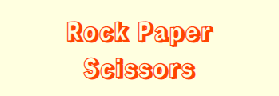

## 2. 2. Rules Section

- Here are the rules of the game simply stated: Rock beats scissors, scissors beats paper, and paper beats rock.
- Whoever wins 10 rounds wins the game.
- Beneath are images of the rules section.

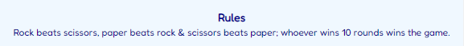

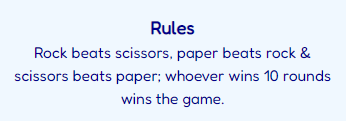

## 2. 3. Play Section

- At the beginning of the play section, a user is instructed to choose one of three options: Either "Rock", "Paper", or "Scissors" to play against the computer.
- A user finds those options underneath those instructions in the form of three emojis, which are put inside three buttons, one for each of the three options.
- As a user chooses an emoji, the computer automatically chooses an emoji.
- The game rules dictate who wins a round of the game.
- Further down are images of the play section.

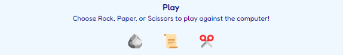

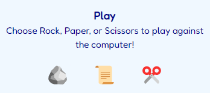

## 2. 4. Outcome Section

- The result of each round will be demonstrated at the top of this section in the "round result" paragraph.
- Below a round's result is the final result of a game that announces who won a game.
- Underneath the fianl result are a player's score and the computer's score, which specify how many rounds a player wins and how many rounds the computer wins.
- If a user wins a round, their score will be incremented by 1; similarly, if the computer wins a round, its score will be incremented by 1. If, however, the result of a round is"tie", the scores will remain the same.
- As soon as a user or the computer has won 10 rounds, the final result paragraph will broadcast that, articulate the winner of a game, and stir a user up to click on the "Reset & Play Again" button, which is both found and accentuated at the bottom of the outcome section, to have a go at a new game.
- Please view the images of the outcome section below.

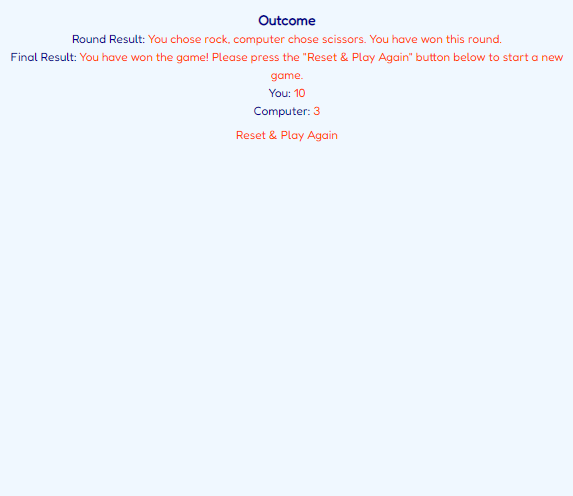

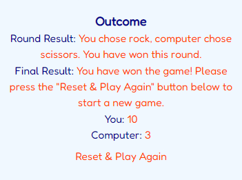

## 2. 5. Footer

- The footer section contains links to the relevant social media sites of the game.
- The links will open a new tab to allow easy navigation for the user.
- Clicking on the Instagram link opens the game's page on Instagram in a new tab.
- Clicking on the Facebook link opens the game's page on Facebook in a new tab.
- Clicking on the Twitter link opens the game's page on Twitter in a new tab.
- A user will treasure the footer, because it facilitates getting connected by way of the social media links of the game.
- Please take a look at some of the relevant images further down.

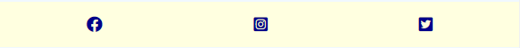

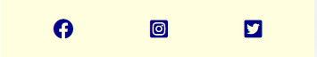

# 3. Future Features

- I would incorporate several difficulty levels into the game.
- On top of that, I would develop the option of multiplayer; for example, between two users.

# 4. Typography & Color Scheme

- Three fonts from Google Fonts have been inserted into the style.css file: "Rampart One", "Fredoka", and "sans-serif".
- Two colors have been applied as font colors: #00008B and #ff4500.
- Two colors have been applied as background colors: #f0f8ff and #ffffe0.
- Three emojis from www.emojipedia.org have been utilized as the game buttons: "rock", "paper", and "scissors".
- Three icons from Font Awesome have been implemented as the social media icons: Facebook, Twitter, and Instagram.

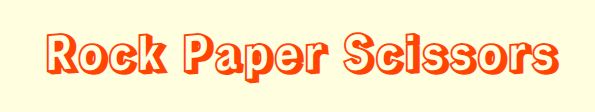

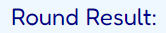

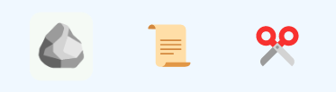

# 5. Wireframes

- Only one wireframe has been created.
- Down is an image of that wireframe thanks to Balsamiq.

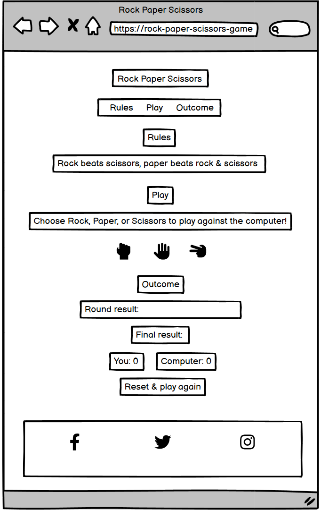

# 6. Technology

## 6. 1. HTML

- Using HTML, I created the content of the Rock Paper Scissor's website, made it accessible, and provided the relevant structure for search engine optimization.

## 6. 2. CSS

- I utilized CSS to make the content of this game's website both visually appealing and responsive on different screen sizes of laptops, tabs, and smartphones.

## 6. 3. JavaScript

- In order to create the logic of the game, I exploited JavaScript, especially its functions.
- I stored the JavaScipt logic of the game in a script.js file.

## 6. 4. Codeanywhere

- Codeanywhere is an efficient cloud-based integrated development environment that I employed to write, review, integrate, and deploy the code of the Rock Paper Scissors website without any need for any installations or configurations.

## 6. 5. GitHub

- A platform for version control and collaborative software development, which I exploited to create a central code repository for and deploy the website of Rock Paper Scissors game project; this, in turn, allows me to keep track of changes made to code and revert to previous versions if needed.

## 6. 6. Balsamiq

- This is the program I applied to generate the framework of the website of the game project.

## 6. 7. Google Fonts

- I resorted to Google Fonts to amplify the look of the Rock Paper Scissors' website, so I integrated two of its fonts into the website by inserting their links in their respective CSS file.
- The "sans-serif" font has been integrated into the style.css file as a backup font.

## 6. 8. Font Awesome

- To enhance the visual design of the game's website, I have turned to Font Awesome and incorporated 3 icons into it as the icons of the social media links in the footer.

## 6. 9. Emojipedia

- In order to enable the game buttons to encompass some pragmatic, quite beautiful emojis, I visited www.emojipedia.org and employed 3 of their emojis: "rock", "paper", and "scissors".

## 6. 10. W3C HTML & CSS Validators

- There exist two W3C validators: Online tools that check HTML and CSS code.
- Exercising both of them, a developer can validate their code by URL, file upload, or direct input.
- I have enacted both W3C validators to scrutinize the html and css files of the Rock Paper Scissors' website.
- I executed only one validation method: by direct input.

## 6. 11. JSHint

- JSHint is an online website that scrutinizes and validates JavaScript code.
- Through direct input, I made use of JSHint to check and validate the script.js file of Rock Paper Scissors.

# 7. Code Validation

## 7. 1. index.html File

- Using the W3C HTML validator, I checked the index.html file. No errors or warnings were shown.
- Below are 2 screenshots that document this validation.

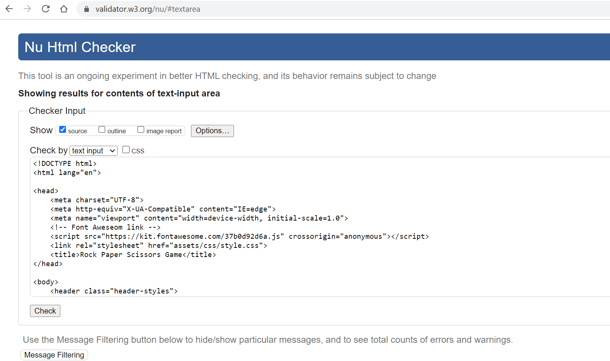

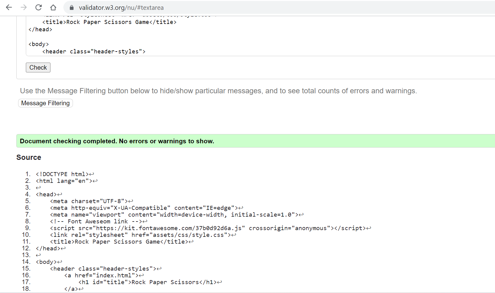

## 7. 2. style.css File

- Applying the W3C CSS validator, I examined the style.css file with the help of the "direct input" method; no errors were found.
- However, one warning was recorded: "Imported style sheets are not checked in direct input and file upload modes".
- I took 2 screenshots of the CSS validation result, please have a look at them lower down.

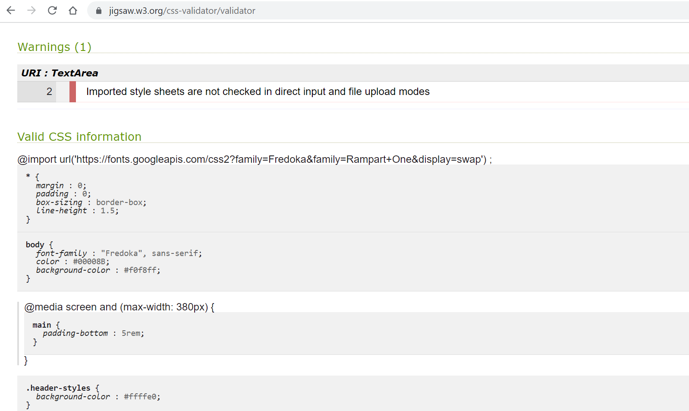

## 7. 3. script.js File

- Taking advantage of JSHint, I validated the script.js file of the game; 17 warnings were issued.
- Kindly inspect the 4 images of this validation further down.

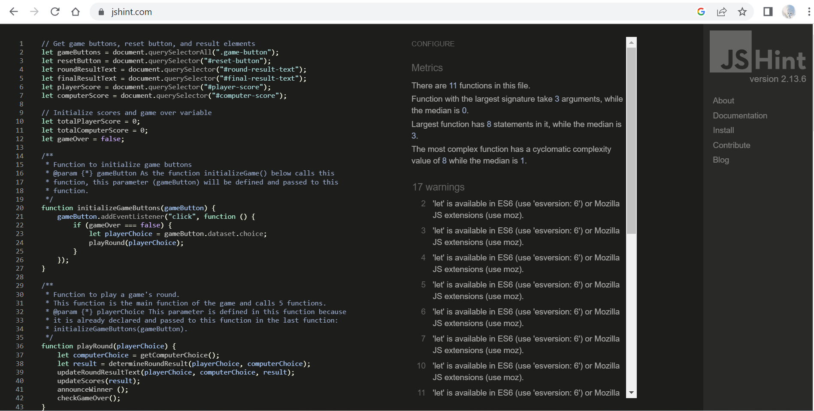

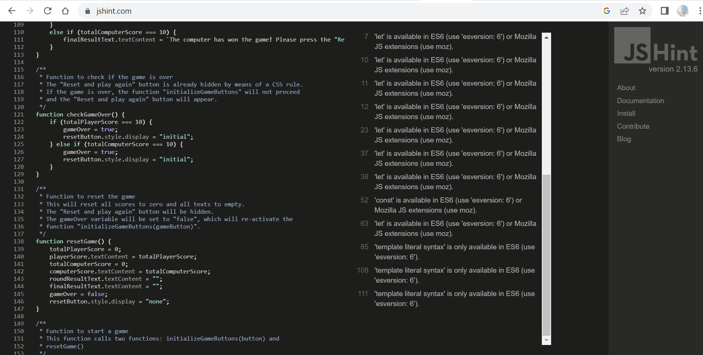

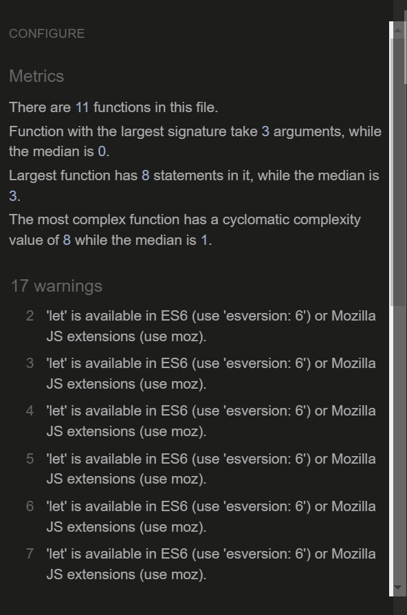

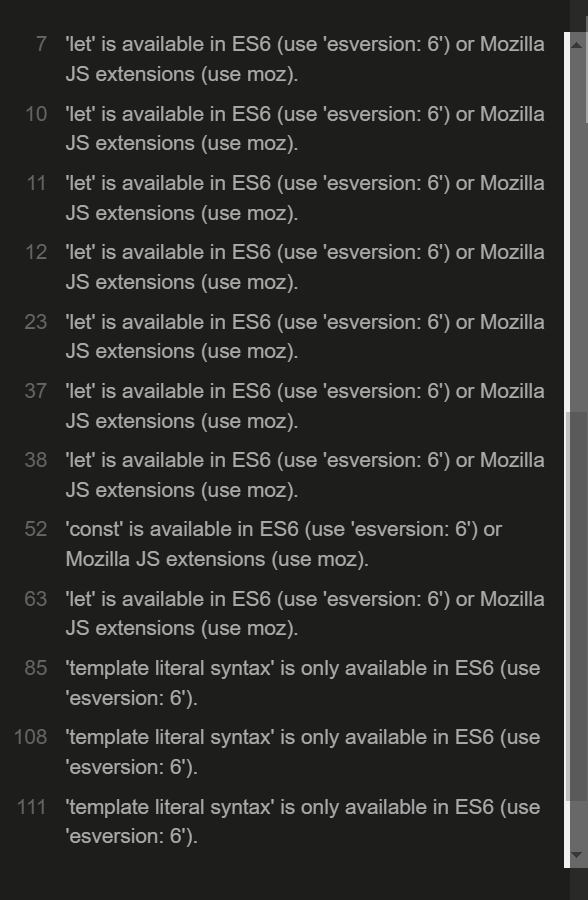

## 7. 4. Google Lighthouse Report

- Please have a look at the relevant image further down.

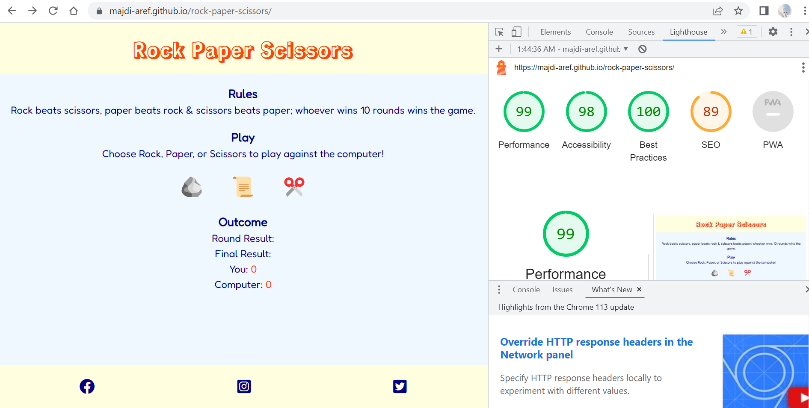

# 8. Test Cases

## 8. 1. Testing the "Rock" Button

- Test description: This test checks the functionality of the "Rock" button.
- Steps:
  - Click on the "Rock" button.
- Expected Results:
  - Clicking on the "Rock" button would make a message appear in the "Round result" paragraph; this message would establish the result of a game's round (tie, a player wins, or the computer wins).
  - If a player or the computer wins a round, the player's score or the computer's score would be incremented by 1 respectively.
  - When a player or the computer wins 10 rounds, the "Reset and Play Again" button would come into sight and a message would pop up in the final result's paragraph reporting that a player or the computer would have won the game and inviting a player to click on the "Reset and Play Again" button to play a new game.
- Actual Result: The actual result is identical to the expected result.
- Two images below registered that the "Rock" button is fully functional.

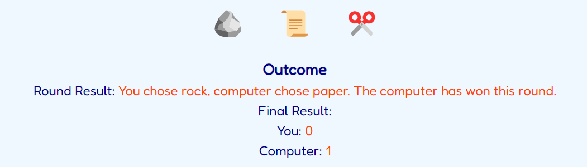

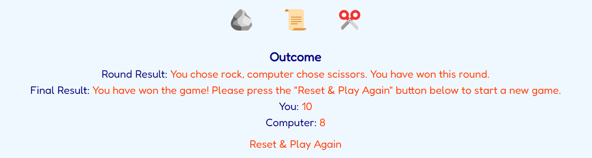

## 8. 2. Testing the "Paper" Button

- Test description: This test checks the functionality of the "Paper" button.
- Steps:
  - Click on the "Paper" button.
- Expected Results:
  - Clicking on the "Paper" button would make a message in the "Round result" paragraph appear, which would establish the result of a game's round (tie, a player wins, or the computer wins).
  - If a player or the computer wins a round, the player's score or the computer's score would be incremented by 1 respectively.
  - When a player or the computer wins 10 rounds, the "Reset and Play Again" button would come into sight and a message would pop up in the final result's paragraph reporting that a player or the computer would have won the game and inviting a player to click on the "Reset and Play Again" button to play a new game.
- Actual Result: The actual result is identical to the expected result.
- Two images below registered that the "Paper" button is fully functional.

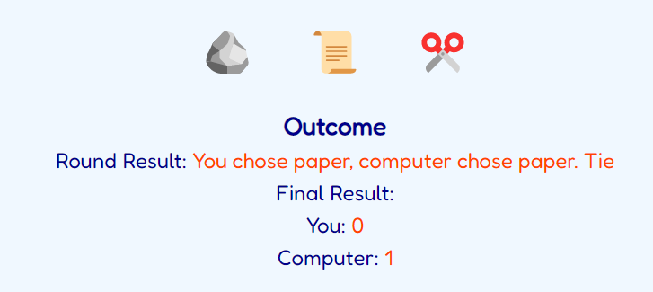

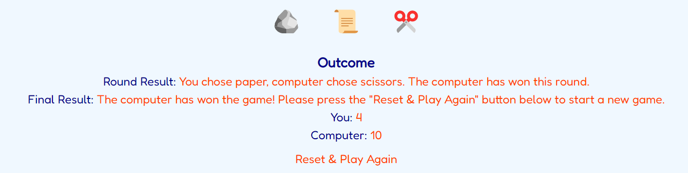

## 8. 3. Testing the "Scissors" Button

- Test description: This test checks the functionality of the "Scissors" button.
- Steps:
  - Click on the "Scissors" button.
- Expected Results:
  - Clicking on the "Scissors" button would make a message in the "Round result" paragraph appear, which would establish the result of a game's round (tie, a player wins, or the computer wins).
  - If a player or the computer wins a round, the player's score or the computer's score would be incremented by 1 respectively.
  - When a player or the computer wins 10 rounds, the "Reset and Play Again" button would come into sight and a message would pop up in the final result's paragraph reporting that a player or the computer would have won the game and inviting a player to click on the "Reset and Play Again" button to play a new game.
- Actual Result: The actual result is identical to the expected result.
- Two images below registered that the "Scissors" button is fully functional.

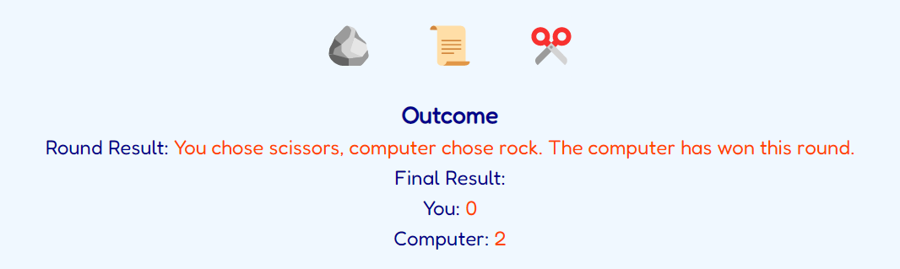

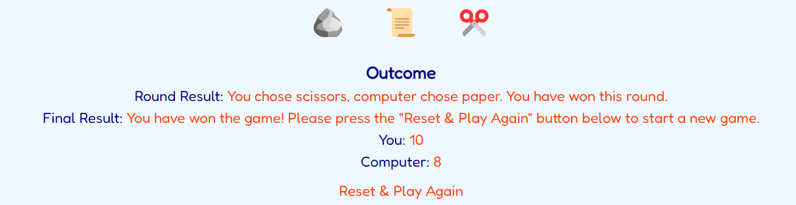

## 8. 4. Testing the "Reset and Play Again" Button

- Test description: This test checks the functionality of the "Reset and Play Again" button.
- Steps:
  - Click on the "Reset and Play Again" button.
- Expected Results: Clicking on the "Reset and Play Again" button would empty the round result's message and the final result's message, would reset a player's score and the computer's score, and would hide the "Reset and Play Again" button.
- Actual Result: The actual result is identical to the expected result.
- Two images beneath registered that the "Reset and Play Again" button is fully functional.

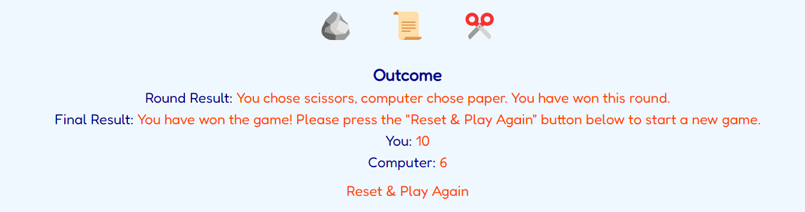

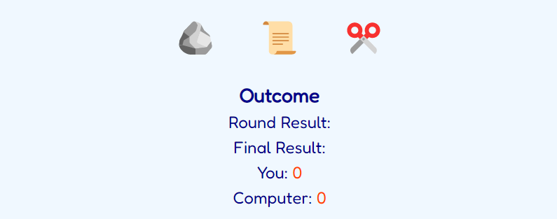

## 8. 5. Testing the link to the Rock Paper Scissors' page on Facebook in the footer

- Test description: This test checks the functionality of the link to the Rock Paper Scissors' page on Facebook in the footer.
- Steps:
  - Click on the link to the Rock Paper Scissors' page on Facebook in the footer.
- Expected Result: The Rock Paper Scissors' page on Facebook should be opened in a new tab for the user.
- Actual Result: The Rock Paper Scissors' page on Facebook was opened in a new tab for the user.

## 8. 6. Testing the link to the Rock Paper Scissors' page on Instagram in the footer

- Test description: This test checks the functionality of the link to the Rock Paper Scissors' page on Instagram in the footer.
- Steps:
  - Click on the link to the Rock Paper Scissors' page on Instagram in the footer.
- Expected Result: The Rock Paper Scissors' page on Instagram should be opened in a new tab for the user.
- Actual Result: The Rock Paper Scissors' page on Instagram was opened in a new tab for the user.

## 8. 7. Testing the link to the Rock Paper Scissors' page on Twitter in the footer

- Test description: This test checks the functionality of the link to the Rock Paper Scissors' page on Twitter in the footer.
- Steps:
  - Click on the link to the Rock Paper Scissors' page on Twitter in the footer.
- Expected Result: The Rock Paper Scissors' page on Twitter should be opened in a new tab for the user.
- Actual Result: The Rock Paper Scissors' page on Twitter was opened in a new tab for the user.

# 9. Fixed Bugs

- I have not encountered any bugs on the game.

# 10. Supported Screens & Browsers

- Applying media queries, I developed the Rock Paper Scissors' website to fit Laptops', tabs', and smartphones' screen sizes.
- The browser that I put to use is Google Chrome.
- Please have a look at the images below; they successively show how the game's page simulates on laptops, tabs, and smartphones.

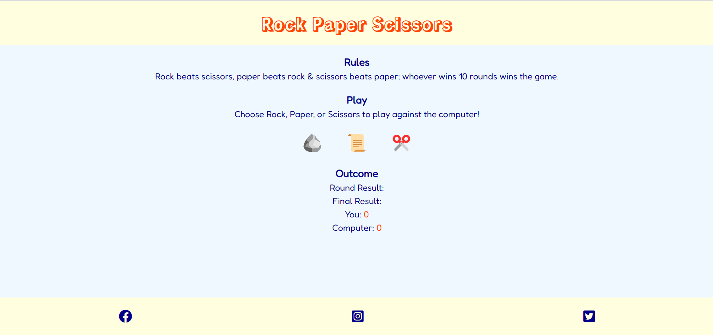

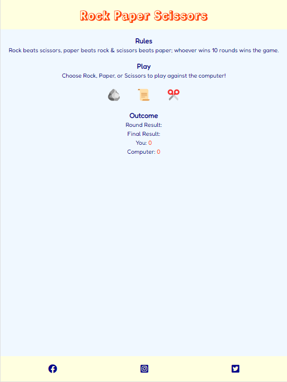

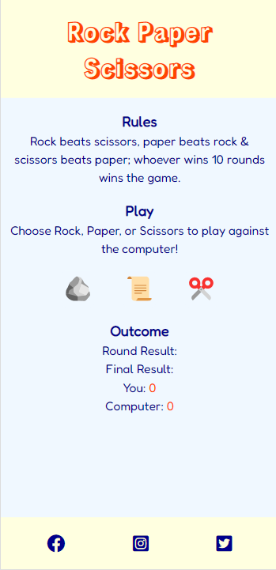

# 11. Deployment

## 11. 1. Via Codeanywhere

- Codeanywhere is a cloud-based development environment that allows you to develop, build, and deploy your website in the cloud.
- Open an account and create a new repository on Github.
- Open Codeanywhere workspaces, then create a new workspace for the new repository that you created on Github; Codeanywhere will save the workspace that you created.
- Open the Codeanywhere workspace that you just created.
- As soon as you have opened your repository in Codeanywhere, you can use the terminal to run the necessary commands to build and deploy your website.
- Using the terminal, create as many html and css files as you need for your project.
- Using the terminal, create a readme.md file for your project.
- Type in the Codeanywhere's terminal the command: "python3 -m http.server", a small window opens at the right bottom corner.
- In that small window, click on "Browser"; this opens your Github's repository through your Codeanywhere workspace in a browser in a new tab.
- Press at that same time "Control + Shift + R" to refresh your browser.
- Press at the same time "Control + S" to save the code you create in Codeanywhere worksace; this will automatically save it in your applicable file in your Codeanywhere workspaces.
- Type in the Codeanywhere terminal the command: "git add ." to add your project's code that you have created during a working session of yours to your Codeanywhere workspace.
- Type in the Codeanywhere terminal the command: "git commit -m 'what code, styling, documentation, or corrections you have made or done in your Codeanywhere workspace in just a few words'" to commit your project's code to your Codeanywhere workspace.
- Type in the Codeanywhere terminal the command: "git push" to push and save your project's code in your Github's repository.

## 11. 2. Via Github

- GitHub is a free code hosting platform for version control and collaboration. It lets you and others work together on projects from anywhere.
- Open Github and sign in.
- Using the menu on the top right corner, click on "Your repositories".
- Click on the repository that you want to open.
- On your repository page, click on "Settings".
- On the settings' page, click on "Pages".
- In Github pages under "Source" under "Build and deploy", choose "Deploy from a branch".
- In Github pages under "branch", choose the option "main" and then click on "Save".
- Typically within a couple minutes, your repository will be deployed; a public URL link of your repository will emerge on top of Github pages.
- Click on the public URL link to open the new website of your repository live in a browser!

# 12. Credits

- Code Institute's JavaScript and DOM tutorials and videos.
- Code Institute's Love Maths walkthrough project.
- W3Schools' HTML, CSS, and JavaScript tutorials
- Open AI's ChatGPT
- Microsoft Bing AI Chat
